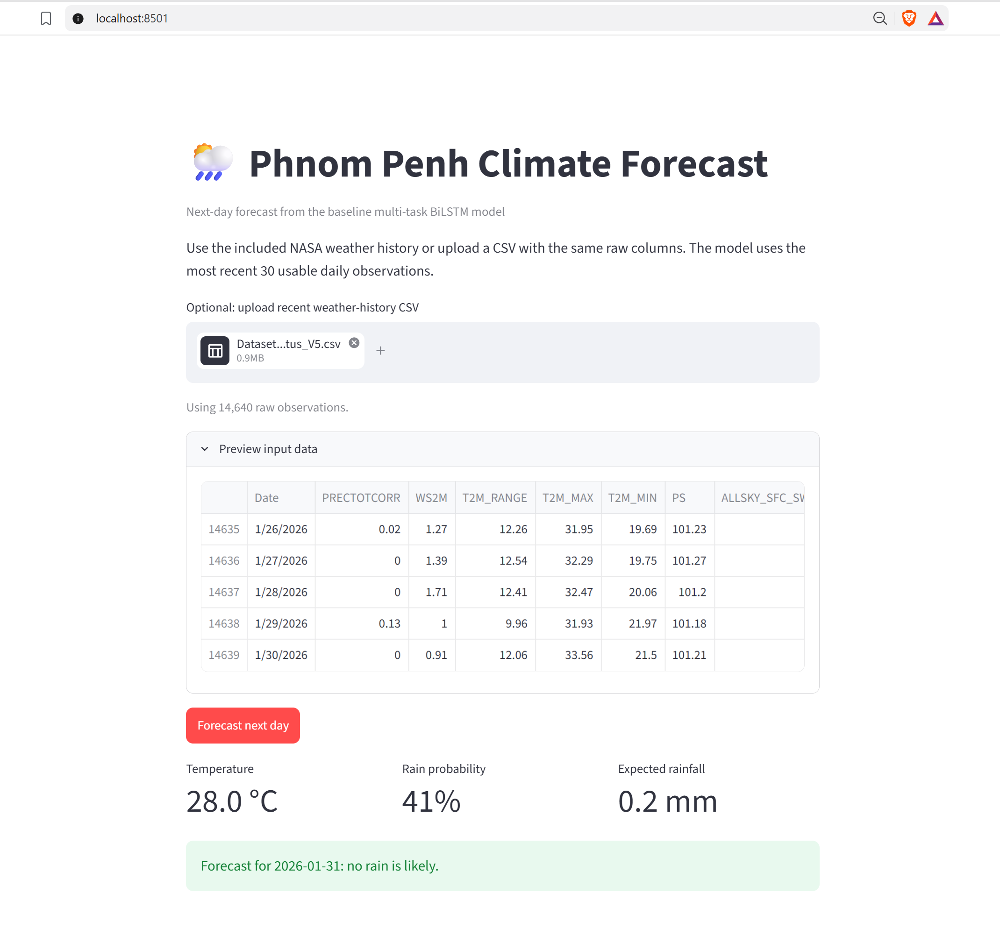

# Phnom Penh Daily Temperature and Rainfall Forecasting — BiLSTM Experiments

This project forecasts daily average temperature and rainfall in Phnom Penh using NASA meteorological data.

It contains two comparable models:

1. **Baseline Multi-task BiLSTM**
   - Temperature regression
   - Rain / no-rain classification
   - Rainfall amount regression

2. **BiLSTM + Attention + Weighted Rainfall Loss**
   - Adds temporal attention
   - Adds weighted rainfall loss to focus more on heavy rain events
   - Keeps the same targets for fair comparison

## Project structure

```text
phnom_penh_climate_bilstm_v2/
├── data/
│   └── Dataset_with_RainStatus_V5.csv
├── src/
│   ├── data.py
│   ├── evaluate.py
│   ├── models/
│   │   ├── baseline_model.py
│   │   └── attention_model.py
│   ├── losses/
│   │   └── weighted_loss.py
│   ├── training/
│   │   └── trainer.py
│   └── utils/
│       ├── plotting.py
│       └── seed.py
├── experiments/
│   ├── train_baseline.py
│   ├── train_attention_weighted.py
│   └── compare_models.py
├── models/
├── outputs/
│   ├── baseline/
│   ├── attention_weighted/
│   └── comparison/
├── config.py
├── requirements.txt
└── README.md
```

## Dataset columns

- `Date`
- `PRECTOTCORR`: precipitation / rainfall
- `WS2M`: wind speed
- `T2M_RANGE`
- `T2M_MAX`
- `T2M_MIN`
- `PS`: atmospheric pressure
- `ALLSKY_SFC_SW_DWN`: solar radiation
- `RH2M`: relative humidity
- `T2MDEW`: dew point temperature
- `RainStatus`: binary rain indicator

## Install

On a machine where UV's default cache or managed-Python directory is not
writable, set project-local locations once in PowerShell before running UV:

```powershell
$env:UV_CACHE_DIR = "$PWD\.uv-cache"
$env:UV_PYTHON_INSTALL_DIR = "$PWD\.uv-python"
```

```bash
# Install the project Python once (UV downloads it if needed).
uv python install 3.12

# Create .venv and install the exact locked dependencies.
uv sync
```

If Windows reports an access-denied error while updating UV's cache, rerun the
last command without caching:

```bash
uv sync --no-cache
```

Run scripts through UV; activation is not required:

```bash
uv run python experiments/train_baseline.py
```

## Run experiments

Train baseline:

```bash
uv run python experiments/train_baseline.py
```

Train improved model:

```bash
uv run python experiments/train_attention_weighted.py
```

Compare models:

```bash
uv run python experiments/compare_models.py
```

## Outputs

Each experiment writes:

```text
outputs/<experiment_name>/metrics.json
outputs/<experiment_name>/predictions.csv
outputs/<experiment_name>/temperature_forecast.png
outputs/<experiment_name>/rainfall_forecast.png
```

The comparison script writes:

```text
outputs/comparison/model_comparison.csv
outputs/comparison/model_comparison_core_metrics.png
```

## Deploy the baseline forecast app

### Application preview



The Streamlit app performs prediction only; it does not train a model. Train
the baseline once to create the required deployable artifacts:

```bash
uv run python experiments/train_baseline.py
```

This produces the model and preprocessing artifacts used by the app:

```text
models/best_baseline.keras
models/baseline_artifacts.joblib
```

Start the application locally:

```bash
uv run streamlit run streamlit_app.py
```

For Streamlit Community Cloud, push the repository including both files above,
then create an app with `streamlit_app.py` as the entrypoint. The root
`requirements.txt` contains the smaller CPU-oriented dependency set used by
the deployed baseline app.

## Research interpretation

The baseline model tests whether a shared BiLSTM representation can learn temperature, rain occurrence, and rainfall amount together. The improved model tests whether attention and weighted rainfall loss improve rare but important heavy-rainfall prediction while preserving temperature accuracy and rain-status detection.


---

## Hybrid SARIMA + BiLSTM Experiment

This version adds a temperature-focused hybrid model.

### Concept

```text
Temperature series
        ↓
SARIMA captures linear + seasonal pattern
        ↓
Residual = Actual - SARIMA prediction
        ↓
BiLSTM learns nonlinear residual
        ↓
Final prediction = SARIMA prediction + BiLSTM residual prediction
```

### Run Hybrid Model

```bash
uv run python experiments/train_hybrid_sarima_bilstm.py
```

### Compare All Models

```bash
uv run python experiments/compare_all_models.py
```

### Hybrid Outputs

```text
outputs/hybrid_sarima_bilstm/
├── metrics.json
├── predictions.csv
├── training_history.csv
├── sarima_summary.txt
├── sarima_config.json
├── hybrid_temperature_forecast.png
└── sarima_vs_hybrid_metrics.png
```

### Notes

- The hybrid SARIMA + BiLSTM model is designed mainly for **temperature**, because temperature is continuous and seasonal.
- Rainfall remains better handled by the multi-task BiLSTM framework because rainfall is zero-heavy, skewed, and event-driven.
